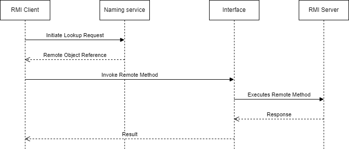
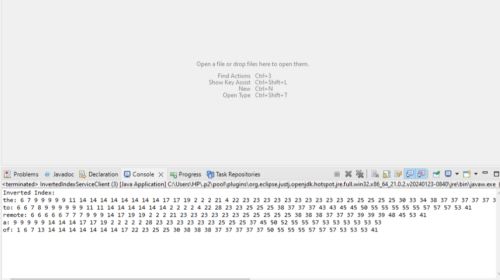
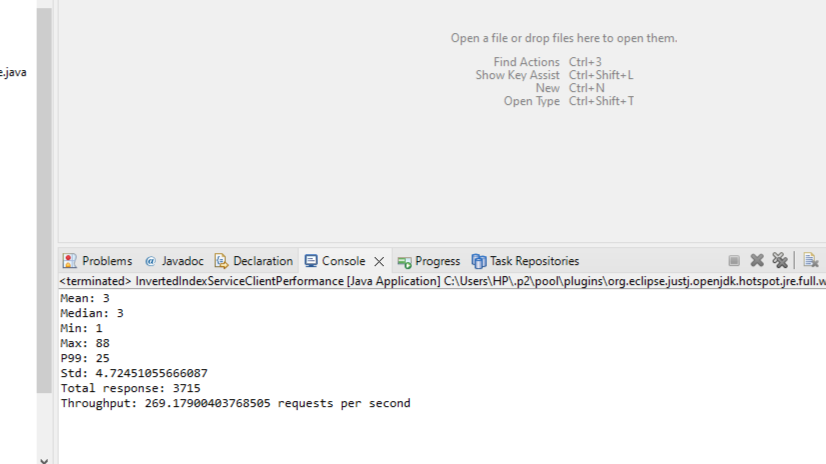
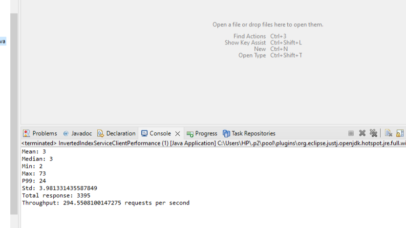

## Introduction
Remote Method Invocation (RMI) is a Java API that allows an object running in one Java Virtual Machine (JVM) to invoke methods on an object running in another JVM. It enables distributed computing and facilitates communication between Java applications over a network. RMI offers several benefits including the following:

1. Simplicity: RMI abstracts away the complexities of network communication, allowing Java developers to focus on their application logic.

2. Efficiency: RMI uses Java’s native serialization mechanism for passing objects between client and server, making it efficient and lightweight.

3. Security: RMI provides built-in security mechanisms such as codebase URLs and security managers to protect against unauthorized access and code execution.

4. Flexibility: RMI supports both synchronous and asynchronous communication paradigms, enabling developers to choose the most suitable approach for their application.

## RMI Mode of Operation
Remote Method Invocation (RMI) in Java enables communication between distributed objects residing in different Java Virtual Machines (JVMs). The RMI system consists of four main components: the client, the server, interface and the naming service.

Client: 

The client initiates communication by invoking remote methods on objects hosted by the server. To interact with the server, the client obtains a reference to the remote object from the Naming service using its registered name.

Server: 

The server hosts one or more remote objects that expose methods accessible to remote clients. It registers these objects with the Naming service, making them available for invocation by remote clients.

Naming Service: 

The Naming service acts as a registry or directory where remote objects are bound to unique names. It provides a lookup mechanism for clients to find the remote objects they wish to interact with.

The interface: 

The interface plays a crucial role in defining the communication protocol between the client and server. It serves as a contract that both parties adhere to, specifying the methods that can be invoked remotely and their signatures. By sharing the same interface definition, the client and server ensure that they communicate using a common set of methods and parameters.

In the sequence diagram as shown above, the steps would include:
1. The client initiates a lookup request to the Naming service to obtain a reference to the remote object by providing its registered name.
2. The Naming service retrieves the reference to the remote object which is the interface and not the actual server object. (NB: This is possible because the server implements the interface). And then the Naming service returns the object to the client.
3. The client invokes remote methods on the remote object using the reference obtained from the Naming service.
4. The server ultimately receives the method invocation request, executes the corresponding method on the remote object, and returns the result to the client.
5. The client receives the method invocation result and continues its execution.

## Results
If the method invocation is successful, the server executes the requested operation and returns the result to the client. The expected outcome of the method invocation is a Map<String, List<Integer>>where each key represents a unique word found in the input text file, and the corresponding value is a list of line numbers where the word appears. The output is shown in the figure below.

## Executors vs ForkJoinPool and Runnable vs Callable

Fork Join Pool: 

It’s part of Java’s java.util.concurrent package, designed for work-stealing algorithms, making it well-suited for tasks that can be broken down into smaller parts recursively. It’s especially useful for CPU-intensive tasks.

Executor Service: 

This is a more general-purpose thread pool framework also in the java.util.concurrent package, suitable for a wide range of asynchronous tasks. It doesn’t employ a work-stealing algorithm but can be used for both CPU and I/O intensive tasks with various types of thread pools.

Runnable: 

A functional interface in Java that represents a task that can be executed asynchronously. It does not return a result or throw checked exceptions.

Callable: 

A functional interface in Java similar to Runnable, but it can return a result and throw checked exceptions. It is often used in conjunction with the ExecutorService interface to submit tasks that need to return a result.

We ran a performance analysis using ExecutorService and Runnable (first figure below), also another performance analysis using Fork Join Pool and Callable (second figure below) for 1000 RMI requests each. From the metrics we extracted, we can clearly see that there isn’t much difference between both currency techniques in terms of accomplishing tasks in this context. (NB: All units are in milliseconds).

## Conclusion
In conclusion, RMI is a powerful technology for building distributed Java applications, providing a seamless way to invoke methods remotely between Java objects.
By leveraging concurrency constructs such as the Executor framework and ForkJoinPool, applications can build highly scalable and efficient RMI services that can handle concurrent client requests effectively. Proper design, implementation, and deployment are essential for ensuring the reliability and performance of RMI-based applications in real-world scenarios.
